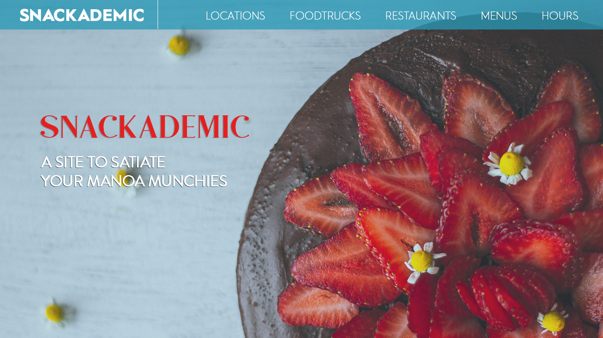

# Snackademic

### Table of Contents
* [Overview](#overview)
* [Goals](#goals)
* [Team](#team)
* [Project Progress & Development History](#project-progress--development-history)
* [Mockup](#mockup)
* [Community Feedback](#community-feedback)
* [Developer Guide](#developer-guide)

### Overview
The goal of Snackademic is to give students at UH a way to keep track of all their favorite foodtrucks and restaurants across campus, see what their menu offerings are, filter by style of food, and see what hours they are open. In the case of foodtrucks, the app will let the student view exactly where on campus they are located for the day. The app will also let UH students rate their favorite restaurants by creating user profiles. User profiles can also be created for restaurants and admins.

The app will be built utilizing [Semantic UI React](https://react.semantic-ui.com/), [Meteor](https://www.meteor.com/), [React](https://reactjs.org/), and [Uniforms](https://uniforms.tools/). Details on how to install and run the application locally will be provided soon.

### Goals:
  * Create a website where students can go to see what food is available, including pages for the following:
    * Food Trucks
    * Resturants/Dining Halls
    * Menus
    * Hours
    * Locations
  * Provide a place to review these food places
    * Written Review individual locations
    * 1-5 star feedback
    
    
### Team:
* [Clark Whitehead](https://github.com/Clark-Whitehead)
* [David Harris](https://github.com/Devoider)
* [Jasmine Singleton](https://github.com/jrsingleton)
* [Ramit Islam](https://github.com/ramytramit)
Please feel free to contact any of us via our GitHub links provided above

### Project Progress & Developmen History
You can follow the team's progress via our Milestones here:
* [M1](https://github.com/the-back-corner/snackademic/projects/1)
* M2
* M3

#### Mockup:

### Community Feedback

We are interested in your experience using Bowfolio! If you would like, please take a couple of minutes to fill out our feedback form here: (coming soon). It contains a few short questions that will help us understand how to improve the system.

### Developer Guide
This section provides information of interest to Meteor developers wishing to use this code base as a basis for their own development tasks (coming soon).