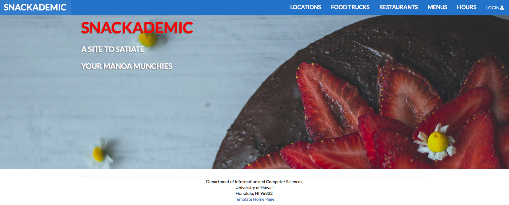
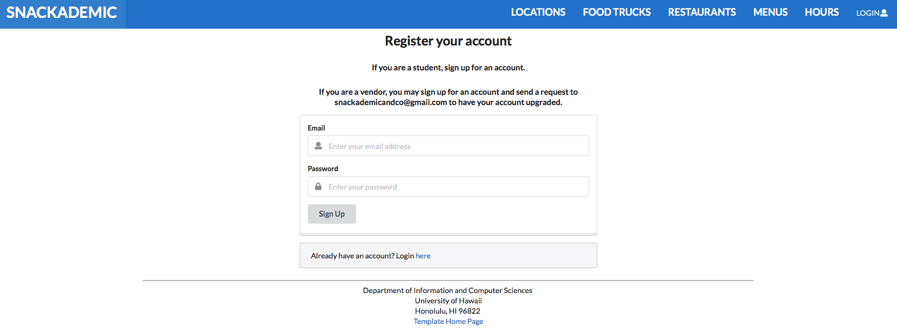
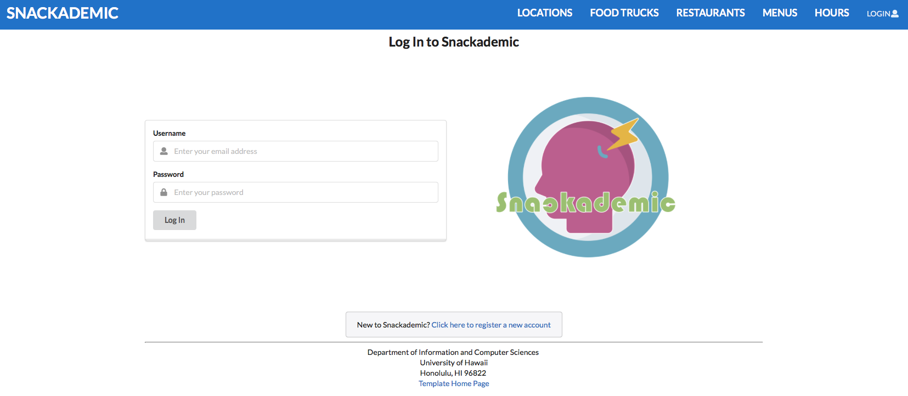
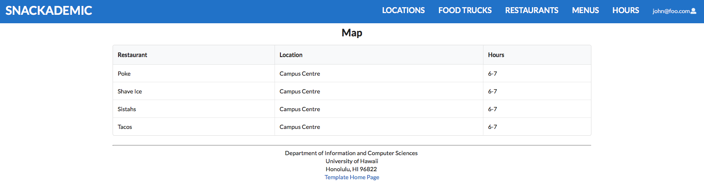

## Table of Contents
* [Overview](#overview)
* [Goals](#goals)
* [Team](#team)
* [Project Progress & Development History](#project-progress--development-history)
* [Mockup](#mockup)
* [Galaxy Deployment](#galaxy-deployment)
* [Developer Guide](#developer-guide)
* [Quality Assurance](#quality-assurance)
* [User Guide](#user-guide)
* [Community Feedback](#community-feedback)


### Overview
The goal of Snackademic is to give students at UH a way to keep track of all their favorite foodtrucks and restaurants across campus, see what their menu offerings are, filter by style of food, and see what hours they are open. In the case of foodtrucks, the app will let the student view exactly where on campus they are located for the day. The app will also let UH students rate their favorite restaurants by creating user profiles. User profiles can also be created for restaurants and admins.

The app will be built utilizing [Semantic UI React](https://react.semantic-ui.com/), [Meteor](https://www.meteor.com/), [React](https://reactjs.org/), and [Uniforms](https://uniforms.tools/). Details on how to install and run the application locally will be provided soon.


### Goals:
  * Create a website where students can go to see what food is available, including pages for the following:
    * Food Trucks
    * Resturants/Dining Halls
    * Menus
    * Hours
    * Locations
  * Provide a place to review these food places
    * Written Review individual locations
    * 1-5 star feedback
    
    
### Team:
Please feel free to contact any of us via our GitHub links provided below.
* [Clark Whitehead](https://clark-whitehead.github.io)
* [David Harris](https://devoider.github.io)
* [Jasmine Singleton](https://jrsingleton.github.io)
* [Ramit Islam](https://ramytramit.github.io)


### Project Progress & Development History
You can follow the team's progress via our Milestones here:
* [M1](https://github.com/the-back-corner/snackademic/projects/1)
* [M2](https://github.com/the-back-corner/snackademic/projects/2)
* [M3](https://github.com/the-back-corner/snackademic/projects/3)


### Mockup:


### Galaxy Deployment:
You can view our deployed page on Galaxy here: [snackademic.meteorapp.com](http://snackademic.meteorapp.com/)
While we still have a bit of work to do to get our aesthetics smoothed out, but you can see some of the progress via the screenshots below.

The first is our [Landing Page](http://snackademic.meteorapp.com/#/), which is similar to our mockup, but we will be updating the visuals by the next milestone.



Next we have our [Sign Up Page](http://snackademic.meteorapp.com/#/signup), where you can register your account. If you're a student, you can sign up for an account here. If you're a vendor (a restaurant or food truck), you can sign up here as well. 



The third page that is currently up for viewing is our [Login Page](http://snackademic.meteorapp.com/#/signin). 



Finally we have our [Locations Page](http://snackademic.meteorapp.com/#/map). This page will eventually have a map with exact restaurant and food truck locations along with their hours. You must be logged in to view this page.



### Developer Guide
This section provides information of interest to Meteor developers wishing to use this code base as a basis for their own development tasks.

#### Installation
First, [install Meteor](https://www.meteor.com/install).

Second, visit the [snackademic application github page](https://github.com/the-back-corner/snackademic), and click the "Use this template" button to create your own repository initialized with a copy of this application. Alternatively, you can download the sources as a zip file or make a fork of the repo. 

Third, go to your newly created repository, and click the "Clone or download" button to download your new GitHub repo to your local file system.  Using [GitHub Desktop](https://desktop.github.com/) is a great choice if you use MacOS or Windows.

Fourth, cd into the app/ directory of your local copy of the repo, and install third party libraries with:

```
$ meteor npm install
```

#### Running the system

Once the libraries are installed, you can run the application by invoking the "start" script in the [package.json file](https://github.com/ics-software-engineering/meteor-application-template-react/blob/master/app/package.json):

```
$ meteor npm run start
```

The first time you run the app, it will create some default users and data. Here is the output:

```
meteor npm run start

> meteor-application-template-react@ start /Users/philipjohnson/github/ics-software-engineering/meteor-application-template-react/app
> meteor --no-release-check --settings ../config/settings.development.json

[[[[[ ~/github/ics-software-engineering/meteor-application-template-react/app ]]]]]

=> Started proxy.
=> Started MongoDB.
I20180227-13:33:02.716(-10)? Creating the default user(s)
I20180227-13:33:02.742(-10)?   Creating user admin@foo.com.
I20180227-13:33:02.743(-10)?   Creating user john@foo.com.
I20180227-13:33:02.743(-10)? Creating default data.
I20180227-13:33:02.743(-10)?   Adding: Basket (john@foo.com)
I20180227-13:33:02.743(-10)?   Adding: Bicycle (john@foo.com)
I20180227-13:33:02.743(-10)?   Adding: Banana (admin@foo.com)
I20180227-13:33:02.744(-10)?   Adding: Boogie Board (admin@foo.com)
=> Started your app.

=> App running at: http://localhost:3000/
```

###Quality Assurance

####ESLint

The application includes a [.eslintrc](https://github.com/ics-software-engineering/meteor-application-template-react/blob/master/app/.eslintrc) file to define the coding style adhered to in this application. You can invoke ESLint from the command line as follows:

```
[~/meteor-application-template-react/app]-> meteor npm run lint

> meteor-application-template-react@ lint /Users/philipjohnson/meteor-application-template-react/app
> eslint --quiet ./imports
```

ESLint should run without generating any errors.

It's significantly easier to do development with ESLint integrated directly into your IDE (such as IntelliJ).


### User Guide


### Community Feedback

We are interested in your experience using Snackademic! If you would like, please take a couple of minutes to fill out our feedback form here: (coming soon). It contains a few short questions that will help us understand how to improve the system.
